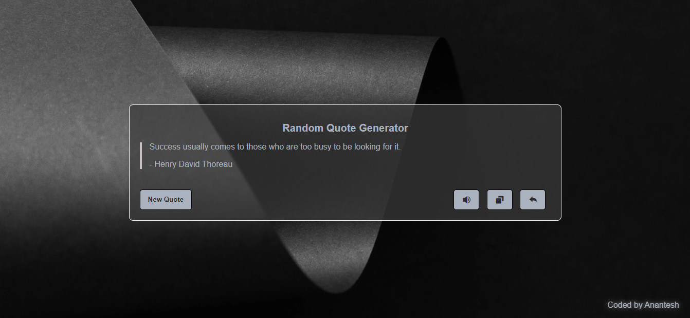

# Quote-generator

This is a minimalistic random quote generator that you can integrate into your website. It's built using HTML, CSS, and JavaScript, making it easy to understand and customize.

## Features
- Display a new random quote with each refresh
- Clean and responsive design
- Tweet This Quote: Share your favorite quotes with the world! A built-in "Tweet" button allows users to instantly share the current quote on Twitter.
- Copy the Quote: Users can copy their favorite quote to the clipboard with the click of a button, making it easy to share elsewhere.
- Listen to the Quote: Enable an audio feature to have the quote read aloud, creating a more immersive experience.

## Preview

